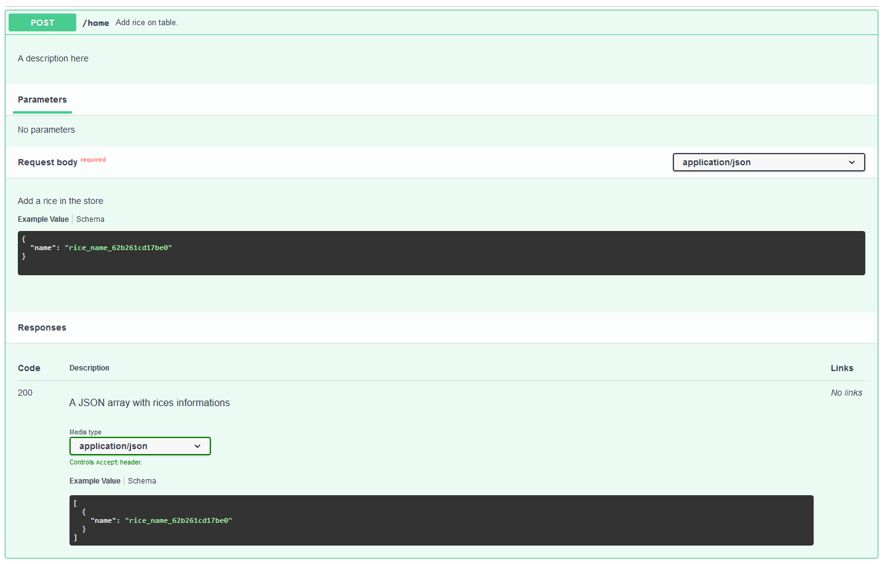
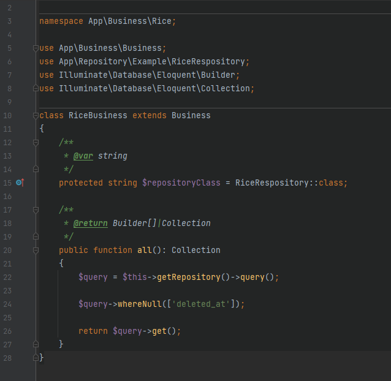
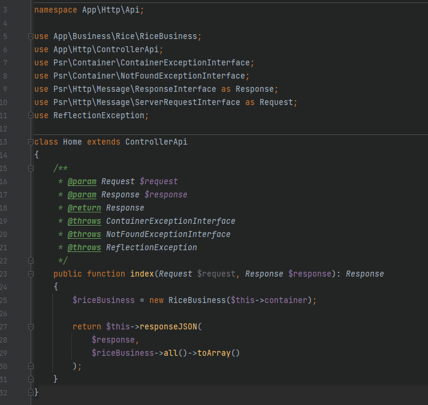

# Skeleton slim framework 4 application (http + cli)

## Console usage

> Here you can see an example how console is showed by application.

## Documentation source

> Here, we can view an example of documentation page.

> Feel free for costumize your documentation API, for yours needs.

## Businees class suport

> You can centralize your business rules on specific classes.

